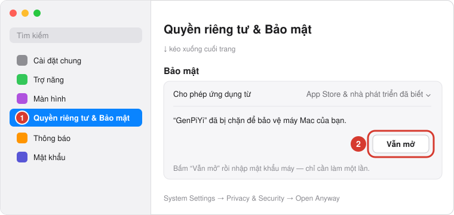

# GenPiYi cho macOS

Bản macOS của GenPiYi — app nhỏ nằm trên **thanh menu** (biểu tượng 拼). Chuột phải vào tin nhắn tiếng Trung trong Zalo / WeChat / LINE… → **Sao chép** (hoặc bôi đen rồi ⌘C), popup hiện **pinyin trên từng chữ Hán** ngay cạnh con trỏ.

*English below.*

## Tính năng (tương đương bản Windows)

| | Windows | macOS |
|---|---|---|
| Tự hiện pinyin khi copy trong app chat | ✅ | ✅ (nhận diện app theo bundle ID) |
| Quét app chat đã cài, bật/tắt từng app, thêm app đang mở | ✅ | ✅ |
| Phím tắt toàn cục (bôi đen → bấm) | `Ctrl+Alt+P` | `⌃⌥P` (đổi được) |
| Chữ đa âm đọc theo ngữ cảnh | ToolGood.Words.Pinyin | Bộ chuyển đổi có sẵn của macOS (`CFStringTransform`) |
| Dấu thanh / số thanh, tô màu thanh điệu, cỡ chữ | ✅ | ✅ |
| 8 mẫu popup (Đêm, Trắng tinh, Sữa dâu, Mèo mướp, Trà xanh, Hoa anh đào, Biển xanh, Ngân hà) | ✅ | ✅ |
| Popup không chiếm focus, click ra ngoài / Esc để đóng, ghim | ✅ | ✅ |
| Copy pinyin / copy chữ Hán + pinyin | ✅ | ✅ |
| Nghĩa từ vựng offline (Việt / Anh) + âm Hán Việt | ✅ | ✅ (dùng chung `data/genpiyi-dict.tsv.deflate`) |
| Tiếng Việt / English | ✅ | ✅ |
| Khởi động cùng hệ điều hành | Registry | Login Items (`SMAppService`) |
| 100% offline, không cần thư viện ngoài | ✅ | ✅ |

## Cài đặt

### Cách 1 — Một dòng lệnh (khuyên dùng, không bị cảnh báo)

Mở **Terminal** (⌘ + Space, gõ `Terminal`), dán dòng dưới rồi bấm Enter:

```bash
curl -fsSL https://raw.githubusercontent.com/dung-nguyentrung/genpiyi/main/macos/install.sh | bash
```

Lệnh sẽ tải bản mới nhất, chép vào **Applications** và mở app (biểu tượng 拼 trên thanh menu). Chạy lại lệnh này bất cứ lúc nào để **cập nhật**. Xem nội dung script tại [`install.sh`](install.sh).

### Cách 2 — Tải file .dmg

1. Tải `GenPiYi-v…-macos.dmg` ở mục [Releases](https://github.com/dung-nguyentrung/genpiyi/releases) (tag `mac-v…`).
2. Mở file .dmg, kéo **GenPiYi** vào **Applications**.
3. Mở GenPiYi. macOS sẽ báo *“Apple không thể xác minh GenPiYi không có phần mềm độc hại”* — bấm **Xong** (đừng bấm *Chuyển vào Thùng rác*).
   Cảnh báo này xuất hiện vì app miễn phí nên không đăng ký công chứng với Apple (99 USD/năm), không phải vì có virus — toàn bộ mã nguồn nằm trong repo này.
4. Vào **Cài đặt hệ thống → Quyền riêng tư & Bảo mật**, kéo xuống cuối, bấm **Vẫn mở** rồi nhập mật khẩu máy. Chỉ cần làm một lần.

   

   > Trên macOS 15 Sequoia trở lên, cách cũ *chuột phải → Mở* không còn dùng được, phải làm theo bước này.
   >
   > Hoặc chạy trong Terminal: `xattr -dr com.apple.quarantine /Applications/GenPiYi.app`

### Sau khi cài

(Tuỳ chọn) Để **phím tắt** tự copy đoạn đang bôi đen, cho phép GenPiYi trong **Quyền riêng tư & Bảo mật → Trợ năng**. Tính năng tự hiện khi copy **không cần** quyền này.

Yêu cầu: macOS 13 Ventura trở lên, chip Apple hoặc Intel.

## Tự build

Cần Xcode 15+ (hoặc Command Line Tools có Swift 5.9+).

```bash
cd macos
swift run                    # chạy thử nhanh (bản debug, không có biểu tượng app)
./scripts/build-app.sh       # tạo dist/GenPiYi.app, .dmg và .zip (universal)
ARCHS=arm64 ./scripts/build-app.sh   # chỉ chip Apple, build nhanh hơn
```

Mở bằng Xcode: `open Package.swift`.

## Cấu trúc mã

| File | Vai trò |
|---|---|
| `main.swift`, `AppController.swift` | Vòng đời app, thanh menu, theo dõi clipboard, phím tắt, quản lý popup |
| `PinyinService.swift` | Hán tự → pinyin (CFStringTransform), chuẩn hoá & đặt dấu thanh, bảng chữ đa âm |
| `PinyinPopup.swift` | Popup nổi (NSPanel không chiếm focus) + giao diện SwiftUI |
| `RubyView.swift` | Bố cục "pinyin trên chữ Hán", tự xuống dòng |
| `Themes.swift` | 8 mẫu giao diện + hình trang trí |
| `MainView.swift`, `SettingsPage.swift` | Cửa sổ chính: Tra pinyin, Giao diện, Cài đặt, Hướng dẫn |
| `ChatAppScanner.swift` | Danh sách app chat (bundle ID), quét app đã cài / đang chạy |
| `HotKey.swift` | Phím tắt toàn cục (Carbon), giả lập ⌘C, quyền Trợ năng |
| `AppSettings.swift`, `Loc.swift` | Cài đặt (JSON trong `~/Library/Application Support/GenPiYi`) và đa ngôn ngữ |

---

## English

GenPiYi for macOS lives in the **menu bar** (拼 icon). Right-click a Chinese message in Zalo / WeChat / LINE… → **Copy** (or select it and press ⌘C) and a popup shows **pinyin above every character** next to your cursor. Select text anywhere and press **⌃⌥P** to do the same in any app.

**Install (recommended, no warning):** open Terminal and run

```bash
curl -fsSL https://raw.githubusercontent.com/dung-nguyentrung/genpiyi/main/macos/install.sh | bash
```

It downloads the latest release, copies it to Applications and opens it; run it again to update. Files fetched with `curl` aren't quarantined, so Gatekeeper doesn't block them.

**Install from .dmg:** download `GenPiYi-v…-macos.dmg` from Releases (tags `mac-v…`) and drag GenPiYi to Applications. On first launch macOS says it *“can't verify GenPiYi is free of malware”* — the app is free and not notarized by Apple (that costs $99/year), the full source is in this repo. Click **Done**, then go to **System Settings → Privacy & Security**, scroll down and click **Open Anyway** (on macOS 15+ right-click → Open no longer works). Or run `xattr -dr com.apple.quarantine /Applications/GenPiYi.app`. For the hotkey to copy the selected text, allow GenPiYi under **Privacy & Security → Accessibility**.

**Build:** `cd macos && ./scripts/build-app.sh` (Xcode 15+, macOS 13+ target).
